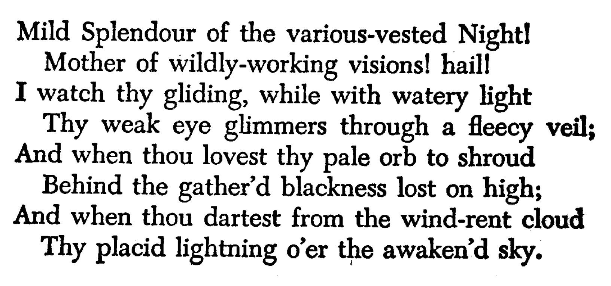

# 一级标题
## 二级标题
...
###### 六级标题

> 引用 1
> 引用 2

> 引用 3

### Super Link
[./Assets/Mild.png](./Assets/Mild.png)

### Local Picture


- 列表 1 
- 列表 2

1. 列表 1
2. 列表 2

- [ ] 任务 1
- [ ] 任务 2

*斜体*

**粗体**

~~划线~~

---

水平线

---

```c++
printf("代码块");
```

```js
console.log("代码块")
```

### 嵌入式网络视频
[Assets/file_example_MP4_480_1_5MG.mp4](./Assets/file_example_MP4_480_1_5MG.mp4)
<video id="video" controls="" preload="none" poster="">
      <source id="mp4" src="https://file-examples-com.github.io/uploads/2017/04/file_example_MP4_480_1_5MG.mp4" type="video/mp4">
</video>

### 嵌入式本地视频
<video id="video" controls="" preload="none" poster="">
      <source id="mp4" src="./Assets/file_example_MP4_480_1_5MG.mp4" type="video/mp4">
</video>

### 嵌入式网络音频
<audio id="audio" controls="" preload="none">
      <source id="mp3" src="https://file-examples-com.github.io/uploads/2017/11/file_example_MP3_700KB.mp3">
</audio>

### 嵌入式本地音频
<audio id="audio" controls="" preload="none">
      <source id="mp3" src="./Assets/file_example_MP3_1MG.mp3">
</audio>

定义
: 具体内容


Here's a sentence with a footnote. [^1]

[^1]: This is the footnote.